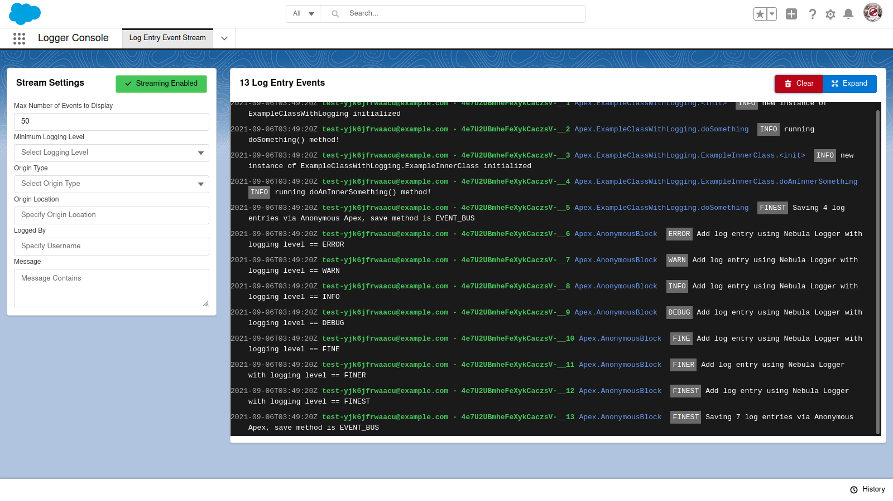

### Real-Time Monitoring with Log Entry Event Stream Tab

Within Logger Console app, the Log Entry Event Stream tab provides real-time monitoring of `LogEntryEvent__e` platform events. Simply open the tab to start monitoring, and use the filters to further refine with `LogEntryEvent__e` records display in the stream.

---
